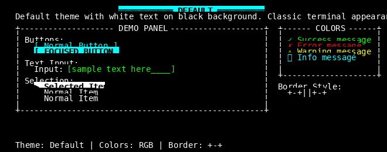
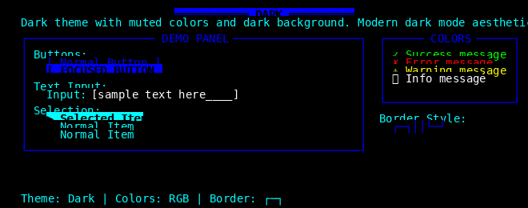
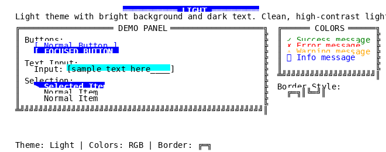
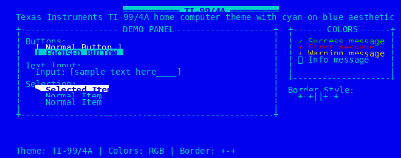
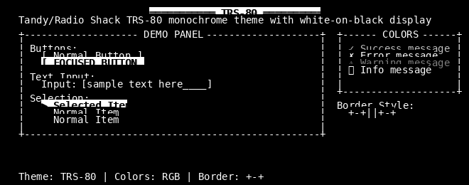
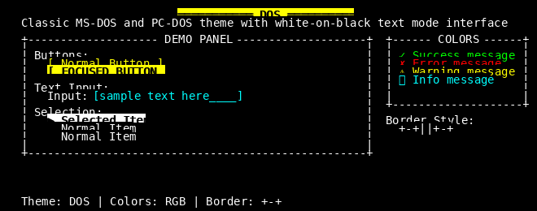
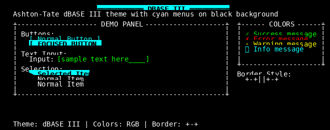
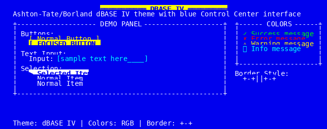
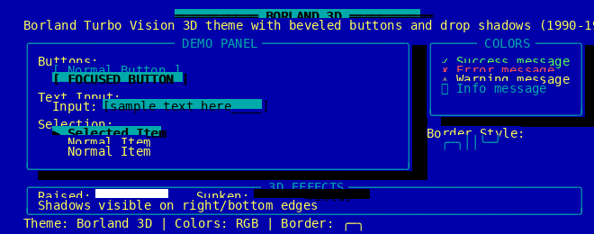
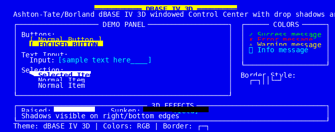

# Theme Gallery

Visual guide to all curses-themes color schemes and border styles.

## Overview

The curses-themes library includes 8 carefully crafted themes split into two categories:

- **Modern Themes** (3): Contemporary color schemes for current applications
- **Retro Themes** (5): Authentic recreations of classic computer interfaces from 1980-1995

Each theme includes coordinated color palettes, semantic color mappings, and period-appropriate border styles.

---

## Modern Themes

### 1. Default Theme

**Classic terminal white-on-black**

The Default theme provides a timeless terminal aesthetic with high contrast and excellent readability.

**Color Palette:**
- Background: White on black
- Buttons: Cyan on black
- Focused: Black on cyan (inverted)
- Text Input: Green on black
- Borders: White on black
- Selection: Black on white

**When to Use:**
- General-purpose terminal applications
- When maximum compatibility is needed
- Applications requiring high contrast
- Traditional CLI tools and utilities

**Load Command:**
```python
from curses_themes import ThemeManager

manager = ThemeManager()
manager.load_theme('default')
```

**Visual Preview:**
```
+----------------------------------+
| Default Theme                    |
| White text on black background   |
|                                  |
| [Button]  [Focused Button]       |
|  Cyan      Black-on-cyan         |
|                                  |
| Input: Green text                |
|                                  |
| Selected: Black on white         |
+----------------------------------+
Border: ASCII +-+||+-+
```



---

### 2. Dark Theme

**Professional dark mode with blues and greens**

Modern dark mode aesthetic with muted colors designed for extended viewing sessions.

**Color Palette:**
- Background: Cyan on black
- Buttons: Blue on black
- Focused: Black on blue (inverted)
- Text Input: White on black
- Borders: Blue on black (Unicode)
- Selection: Black on cyan

**When to Use:**
- Modern applications with dark mode preference
- Reduced eye strain in low-light environments
- Professional development tools
- Contemporary UI design patterns

**Load Command:**
```python
from curses_themes import ThemeManager

manager = ThemeManager()
manager.load_theme('dark')
```

**Visual Preview:**
```
┌──────────────────────────────────┐
│ Dark Theme                       │
│ Cyan text on black background    │
│                                  │
│ [Button]  [Focused Button]       │
│  Blue      Black-on-blue         │
│                                  │
│ Input: White text                │
│                                  │
│ Selected: Black on cyan          │
└──────────────────────────────────┘
Border: Unicode ┌─┐││└─┘
```

---

### 3. Light Theme

**High contrast light theme**



Clean, bright interface with dark text on light background for daytime use.

**Color Palette:**
- Background: Black on white
- Buttons: Blue on white
- Focused: White on blue (inverted)
- Text Input: Black on cyan
- Borders: Black on white (Unicode double-line)
- Selection: White on blue

**When to Use:**
- Well-lit environments and outdoor use
- Applications requiring maximum readability
- Users who prefer light mode interfaces
- Professional document editing

**Load Command:**
```python
from curses_themes import ThemeManager

manager = ThemeManager()
manager.load_theme('light')
```

**Visual Preview:**
```
╔══════════════════════════════════╗
║ Light Theme                      ║
║ Black text on white background   ║
║                                  ║
║ [Button]  [Focused Button]       ║
║  Blue      White-on-blue         ║
║                                  ║
║ Input: Black on cyan             ║
║                                  ║
║ Selected: White on blue          ║
╚══════════════════════════════════╝
Border: Unicode double ╔═╗║╚═╝║
```

---

## Retro Themes

### 4. TI-99/4A Theme (1981-1984)

**Texas Instruments TI-99/4A home computer**

Recreates the warm cyan-on-blue palette of the first 16-bit home computer.

**Historical Context:**
The TI-99/4A competed with the Commodore 64 and Apple II. Its distinctive cyan text on medium blue background became iconic in the BASIC programming environment. The color scheme was warmer and more inviting than the stark white-on-black of competitors.



**Color Palette:**
- Background: Cyan on blue
- Buttons: White on blue
- Focused: Blue on cyan (inverted)
- Text Input: Cyan on blue
- Borders: Cyan on blue
- Selection: Blue on white

**When to Use:**
- Retro computing applications
- Educational software with nostalgic appeal
- BASIC programming environments
- Home computer emulators

**Load Command:**
```python
from curses_themes import ThemeManager

manager = ThemeManager()
manager.load_theme('ti994a')
```

**Visual Preview:**
```
+----------------------------------+
| TI-99/4A Theme (1981-1984)      |
| Cyan text on blue background     |
| First 16-bit home computer       |
|                                  |
| [Button]  [Focused Button]       |
|  White     Blue-on-cyan          |
|                                  |
| Warm, inviting color scheme      |
| Perfect for BASIC programming    |
+----------------------------------+
Border: ASCII +-+||+-+ (1981-era)
```

---

### 5. TRS-80 Theme (1980-1983)

**Tandy/Radio Shack TRS-80 Model III and Model 4**

Pure monochrome white-on-black display matching the professional business aesthetic.

**Historical Context:**
The TRS-80 was one of the "1977 Trinity" of home computers. The Model III and 4 featured crisp monochrome displays that made them popular for business applications and word processing. Radio Shack marketed the professional appearance, contrasting it with "toy-like" color displays.



**Color Palette:**
- Background: White on black (monochrome)
- Buttons: White on black
- Focused: Black on white (inverted)
- Text Input: White on black
- Borders: White on black
- Selection: Black on white
- Disabled: Black on black (hidden)

**When to Use:**
- Minimalist terminal applications
- Word processing and business tools
- Monochrome display simulation
- Maximum readability focus

**Load Command:**
```python
from curses_themes import ThemeManager

manager = ThemeManager()
manager.load_theme('trs80')
```

**Visual Preview:**
```
+----------------------------------+
| TRS-80 Theme (1980-1983)        |
| White text on black background   |
| Pure monochrome display          |
|                                  |
| [Button]  [Focused Button]       |
|  White     Black-on-white        |
|                                  |
| Professional business aesthetic  |
| Crisp P4 white phosphor CRT      |
+----------------------------------+
Border: ASCII +-+||+-+ (early 80s)
```

---

### 6. DOS Theme (1981-1995)

**MS-DOS and PC-DOS text mode interface**

The iconic interface that powered the IBM PC era with strategic use of yellow menus and cyan input fields.

**Historical Context:**
MS-DOS powered the IBM PC and compatibles from 1981 through the mid-1990s. Its 80x25 text mode with 16 colors became the de facto standard for PC software. Key applications like WordPerfect, Lotus 1-2-3, and dBASE all shared this visual language.



**Color Palette:**
- Background: White on black
- Buttons: Yellow on black (menu highlighting)
- Focused: Black on yellow (inverted)
- Text Input: Cyan on black
- Borders: White on black
- Selection: Black on white
- Disabled: Black on black (hidden)

**When to Use:**
- Command-line utilities
- Database applications
- Business software with DOS heritage
- Retro PC gaming interfaces

**Load Command:**
```python
from curses_themes import ThemeManager

manager = ThemeManager()
manager.load_theme('dos')
```

**Visual Preview:**
```
+----------------------------------+
| DOS Theme (1981-1995)           |
| White text on black background   |
|                                  |
| [Menu Item] [Selected Menu]      |
|   Yellow     Black-on-yellow     |
|                                  |
| Input Field: Cyan text           |
|                                  |
| CGA/EGA/VGA 16-color palette     |
| IBM extended ASCII compatible    |
+----------------------------------+
Border: ASCII +-+||+-+ (code page 437)
```

---

### 7. dBASE III Theme (1984-1985)

**Ashton-Tate dBASE III and dBASE III Plus**

The signature cyan menu highlighting that became synonymous with database applications.

**Historical Context:**
dBASE III revolutionized database management on PCs, bringing mainframe-style capabilities to the IBM PC. Its distinctive cyan-on-black interface for menus and white command-line "dot prompt" became iconic. By 1985, dBASE III Plus was the best-selling database software, and its .dbf format became an industry standard.

**Color Palette:**


- Background: White on black (dot prompt)
- Buttons: Cyan on black (signature menu color)
- Focused: Black on cyan (inverted)
- Text Input: Green on black (data entry)
- Borders: White on black
- Selection: Black on cyan
- Disabled: Black on black (hidden)

**When to Use:**
- Database management tools
- Data entry applications
- xBase/Clipper/FoxPro legacy systems
- Business application with database focus

**Load Command:**
```python
from curses_themes import ThemeManager

manager = ThemeManager()
manager.load_theme('dbase3')
```

**Visual Preview:**
```
+----------------------------------+
| dBASE III Theme (1984-1985)     |
| . dot prompt (white on black)    |
|                                  |
| [Menu Item] [Selected Menu]      |
|   Cyan       Black-on-cyan       |
|                                  |
| Data Entry: Green text           |
|                                  |
| Iconic database interface        |
| xBase programming language       |
+----------------------------------+
Border: ASCII +-+||+-+ (simple box)
```

---

### 8. dBASE IV Theme (1988-1993)

**Ashton-Tate/Borland dBASE IV Control Center**

The modernized blue-background interface that evolved database tools toward GUI-inspired design.

**Historical Context:**
dBASE IV (1988) introduced a revolutionary windowed interface with pull-down menus and mouse support. The Control Center replaced the traditional dot prompt with a blue background and yellow/white text scheme. This represented the evolution from command-line to GUI-inspired database tools and influenced applications throughout the 1990s.

**Color Palette:**
- Background: White on blue (Control Center)
- Buttons: Yellow on blue (menu highlighting)


- Focused: Blue on yellow (inverted)
- Text Input: Cyan on blue (data entry)
- Borders: White on blue
- Selection: Blue on white
- Disabled: Blue on blue (dimmed)

**When to Use:**
- Modern database applications with retro styling
- Windowed TUI applications
- Menu-driven business software
- Applications transitioning from CLI to GUI

**Load Command:**
```python
from curses_themes import ThemeManager

manager = ThemeManager()
manager.load_theme('dbase4')
```

**Visual Preview:**
```
+----------------------------------+
| dBASE IV Theme (1988-1993)      |
| White text on blue background    |
| Control Center interface         |
|                                  |
| [Menu Item] [Selected Menu]      |
|   Yellow     Blue-on-yellow      |
|                                  |
| Input Field: Cyan text           |
|                                  |
| Windowed, GUI-inspired design    |
| Pull-down menus and mouse        |
+----------------------------------+
Border: ASCII +-+||+-+ (80x25 text)
```

---

## Theme Comparison Table

| Theme | Era | Background | Primary Color | Border Style | Best For |
|-------|-----|------------|---------------|--------------|----------|
| **Default** | Modern | White/Black | Cyan | ASCII `+-+\|\|+-+` | General purpose, high contrast |
| **Dark** | Modern | Cyan/Black | Blue | Unicode `┌─┐\|\|└─┘` | Dark mode, professional tools |
| **Light** | Modern | Black/White | Blue | Unicode `╔═╗\║╚═╝\║` | Bright environments, documents |
| **TI-99/4A** | 1981-1984 | Cyan/Blue | White | ASCII `+-+\|\|+-+` | Retro computing, BASIC |
| **TRS-80** | 1980-1983 | White/Black | White | ASCII `+-+\|\|+-+` | Monochrome, business apps |
| **DOS** | 1981-1995 | White/Black | Yellow | ASCII `+-+\|\|+-+` | CLI utilities, PC heritage |
| **dBASE III** | 1984-1985 | White/Black | Cyan | ASCII `+-+\|\|+-+` | Database apps, data entry |
| **dBASE IV** | 1988-1993 | White/Blue | Yellow | ASCII `+-+\|\|+-+` | Windowed TUI, menus |



---

## Quick Reference

### Loading Themes

```python
from curses_themes import ThemeManager

# Initialize manager
manager = ThemeManager()

# Load any theme by name
manager.load_theme('default')   # or 'dark', 'light', 'ti994a', etc.

# Get theme information
theme = manager.get_current_theme()
print(f"Theme: {theme.name}")
print(f"Description: {theme.description}")
```

### Theme Names

Use these exact names when loading themes:

- **Modern:** `default`, `dark`, `light`
- **Retro:** `ti994a`, `trs80`, `dos`, `dbase3`, `dbase4`

### Color Components

All themes provide these color pairs:

- `background` - Main window background
- `button` - Buttons and menu items
- `button_focused` - Selected/focused buttons
- `text_input` - Input fields and editable text
- `border` - Window borders and frames
- `selection` - Selected items in lists
- `disabled` - Disabled/inactive elements

### Border Styles

Themes use two border character sets:

1. **ASCII** (`+-+||+-+`) - Universal compatibility, retro themes
2. **Unicode** (`┌─┐││└─┘` or `╔═╗║╚═╝║`) - Modern appearance, requires UTF-8

---

## Screenshot Gallery

**Note:** Automated screenshot generation is planned for a future release. Screenshots will show each theme applied to real applications including:

- Text editor interface
- Dialog boxes and menus
- Data entry forms
- List/table views
- Button groups and controls

In the meantime, the ASCII mockups in each theme section provide a visual preview of the color schemes and border styles.

---

## Contributing Themes

Want to add a new theme? See [CONTRIBUTING.md](CONTRIBUTING.md) for:

- Theme design guidelines
- Color palette requirements
- Testing procedures
- Submission process

Historical themes should include era information and authentic color choices. Modern themes should focus on usability and accessibility.

---

## License

All themes are licensed under the MIT License. See [LICENSE](LICENSE) for details.

Copyright (C) 2024 FlossWare


---

## 3D Effect Themes

### 9. Borland 3D Theme

**Professional 3D-styled UI inspired by Turbo Vision**

Recreates the sophisticated windowing aesthetic of Borland's Turbo Vision framework, popular in the 1990s for professional development tools.

**Color Palette:**
- Background: Gray
- Foreground: Black on light gray
- Buttons: Black on light gray with 3D beveled borders
- Focused: Black on cyan with 3D shadow effect
- Shadow: Dark gray shadows beneath all UI elements
- Borders: 3D Unicode box-drawing characters

**When to Use:**
- IDE-style applications
- Development tools and debuggers
- Professional business applications
- Sophisticated terminal UIs requiring visual depth

**Load Command:**
```python
from curses_themes import ThemeManager

manager = ThemeManager()
manager.load_theme('borland-3d')
```

**Visual Preview:**
```
╔══════════════════════════════════╗
║ Borland 3D Theme                 ║
║ Professional IDE aesthetic       ║
║                                  ║
║ ╔════════╗  ╔════════════╗       ║
║ ║ Button ║  ║ Focused    ║▓      ║
║ ╚════════╝▓ ╚════════════╝▓      ║
║  Light gray  Cyan + shadow       ║
║                                  ║
║ All elements have 3D depth       ║
╚══════════════════════════════════╝▓
▓▓▓▓▓▓▓▓▓▓▓▓▓▓▓▓▓▓▓▓▓▓▓▓▓▓▓▓▓▓▓▓▓▓▓▓
Border: Unicode ╔═╗║╚╝ with shadows
```



---

### 10. dBASE IV 3D Theme

**3D windowed database UI aesthetic from dBASE IV**

Combines the classic dBASE IV blue interface with modern 3D depth effects for a sophisticated database application look.

**Color Palette:**
- Background: Blue
- Foreground: White on blue
- Buttons: White on blue with 3D beveled borders
- Focused: Black on cyan with 3D shadow
- Menu Bar: Black on cyan
- Shadow: Dark blue/black shadows
- Borders: 3D Unicode box-drawing

**When to Use:**
- Database management applications
- Data entry and reporting tools
- Business intelligence dashboards
- Professional database UIs requiring visual hierarchy

**Load Command:**
```python
from curses_themes import ThemeManager

manager = ThemeManager()
manager.load_theme('dbase-iv-3d')
```

**Visual Preview:**
```
╔══════════════════════════════════╗
║ dBASE IV 3D Theme                ║
║ White text on blue background    ║
║                                  ║
║ ╔════════╗  ╔════════════╗       ║
║ ║ Button ║  ║ Focused    ║▓      ║
║ ╚════════╝▓ ╚════════════╝▓      ║
║  White/Blue  Black/Cyan          ║
║                                  ║
║ Menu: Black on cyan background   ║
╚══════════════════════════════════╝▓
▓▓▓▓▓▓▓▓▓▓▓▓▓▓▓▓▓▓▓▓▓▓▓▓▓▓▓▓▓▓▓▓▓▓▓▓
Border: Unicode ╔═╗║╚╝ with 3D shadows
```



---

## Theme Comparison Matrix

| Theme | Category | Era | Colors | Borders | 3D Effects | Best For |
|-------|----------|-----|--------|---------|------------|----------|
| Default | Modern | Timeless | B&W | ASCII | No | Universal compatibility |
| Dark | Modern | 2020s | Blue/Cyan | Unicode | No | Low-light coding |
| Light | Modern | 2020s | High contrast | Unicode | No | Bright environments |
| TI-99/4A | Retro | 1981-1984 | Cyan/Blue | ASCII | No | Gaming UIs, nostalgia |
| TRS-80 | Retro | 1980-1983 | White/Black | ASCII | No | Authentic retro |
| DOS | Retro | 1981-1995 | White/Yellow | ASCII | No | System utilities |
| dBASE III | Retro | 1984-1985 | Cyan menus | ASCII | No | Database apps |
| dBASE IV | Retro | 1988-1993 | Blue bg | ASCII | No | Database UIs |
| Borland 3D | 3D | 1990-1997 | Gray/Cyan | Unicode | Yes | IDEs, dev tools |
| dBASE IV 3D | 3D | 1988-1993 | Blue/Cyan | Unicode | Yes | Database UIs with depth |
